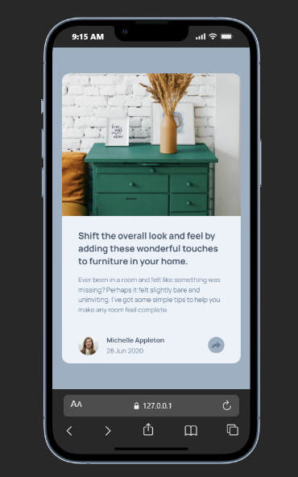
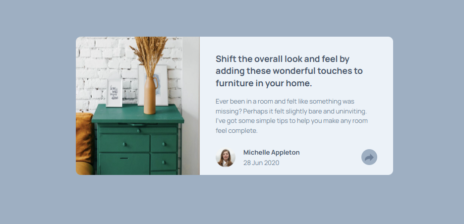

## Table of contents

- [Overview](#overview)
  - [The challenge](#the-challenge)
  - [Screenshot](#screenshot)
  - [Links](#links)
- [My process](#my-process)
  - [Built with](#built-with)
  - [What I learned](#what-i-learned)
  - [Continued development](#continued-development)
  - [Useful resources](#useful-resources)
- [Author](#author)
- [Acknowledgments](#acknowledgments)

## Overview

### The challenge

Users should be able to:

- View the optimal layout for the component depending on their device's screen size
- See the social media share links when they click the share icon

### Screenshot

#### Mobile view

#### Desktop View

### Links

- Solution URL: [here](https://github.com/Nehhy01/Article-Preview-Component.git)
- Live Site URL: [Go Live](https://your-live-site-url.com)

## My process

### Built with

- Semantic HTML5 markup
- CSS custom properties
- Flexbox
- Mobile-first workflow

### What I learned

- Learned how to style an SVG
- Rfreshed my memory on DOM manipulations and selectors, its fun.

### Useful resources

- [To Style SVG](https://css-tricks.com/change-color-of-svg-on-hover/) - This helped me in adding colors to my SVG. I really liked this pattern and will use it going forward.

## Author
- Frontend Mentor - [@nehhy01](https://www.frontendmentor.io/profile/nehhy01)
- GitHub - [@Nehhy01] (https://github.com/Nehhy01)
- LinkedIn [@Ola_Nehemiah] (https://www.linkedin.com/in/nehemiah-ola)

## Acknowledgments

- Thanks to Frontend Mentor strong developers' commuity on Discord, i looked up some people's challenge and found solutions to my bugs.
